<div align="center">

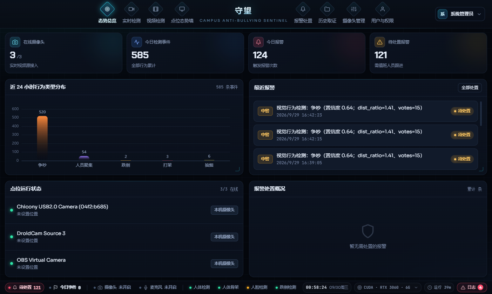

# 守望 · Sentinel

**校园反霸凌智能检测系统**

视觉行为识别 × 语音关键词双引擎 · 实时报警 · 自动取证

[](https://vuejs.org/)
[](https://fastapi.tiangolo.com/)
[](https://docs.ultralytics.com/)
[](https://www.python.org/)
[](#许可)

</div>

---

## 关于

**守望（Sentinel）** 是一套面向中小学与高校场景的 AI 反霸凌监测系统。

它把**视觉行为识别**与**语音关键词检测**两条链路拧在一起：摄像头侧识别人体、骨架、人脸与异常行为（跌倒、打架、吵架、抽烟、聚集），麦克风侧实时转写并匹配霸凌相关词句。任一链路命中即触发报警，系统自动截取事发前后画面、剪辑视频片段、落库检测事件与转写文本，形成一条可追溯、可导出的完整取证链。

设计上刻意划清两条边界：**人脸识别默认关闭且必须逐人取得授权**（未授权的学生不进底库、不参与识别，只在画面上出现一个人脸框；授权与撤回全程留痕，详见「生物特征合规」一节），**不依赖云端视觉服务**（视觉推理全部本地完成，语音识别可插拔云端或本地，断网可降级）。

> 让霸凌无处遁形，让处置有据可依。

## 界面一览

<table>
<tr>
<td width="50%">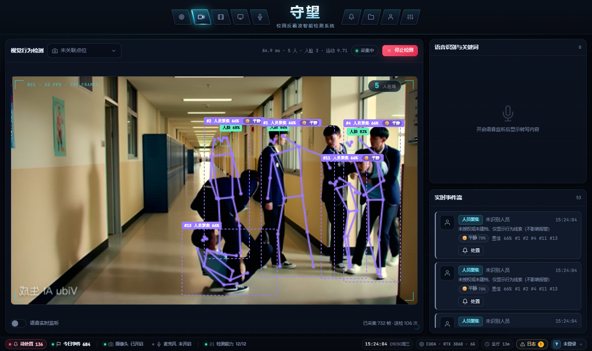<br/><div align="center"><b>实时检测</b> · 人体框 / 骨架 / 人脸叠加，人数统计与轨迹编号，行为判定与语音转写</div></td>
<td width="50%">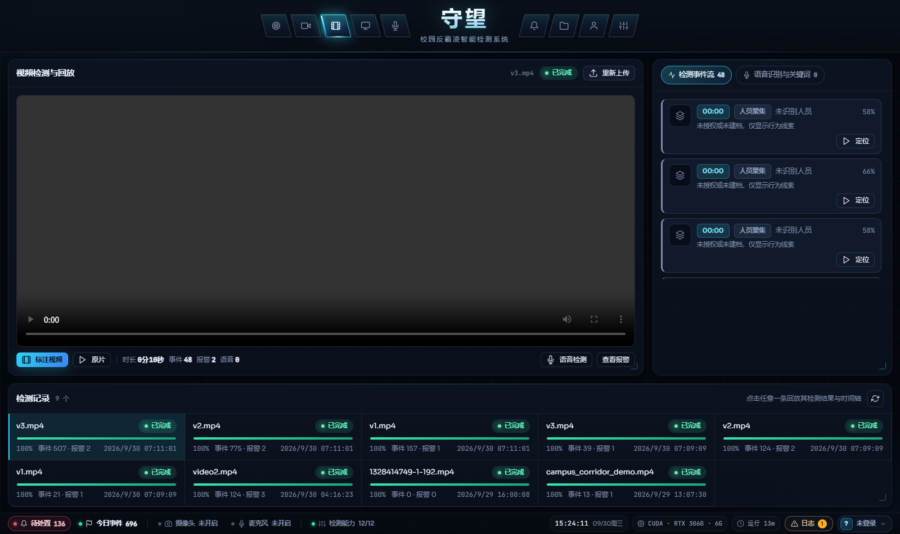<br/><div align="center"><b>视频检测</b> · 上传成片离线分析，右侧实时输出事件流与语音关键词，完成后回放标注视频</div></td>
</tr>
<tr>
<td width="50%">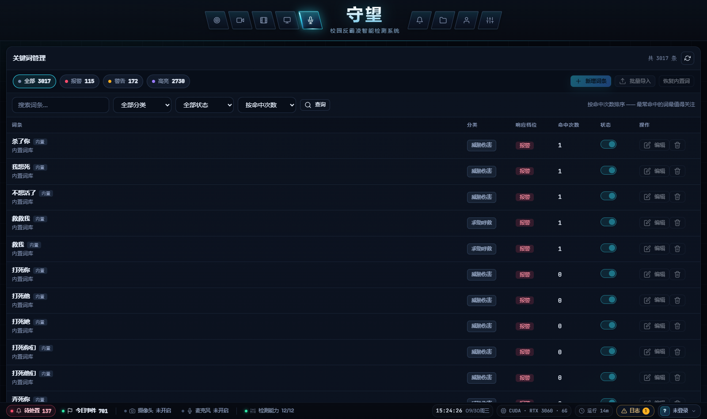<br/><div align="center"><b>关键词管理</b> · 三千条词库分报警 / 警告 / 关注三档，可增删改查与批量导入</div></td>
<td width="50%">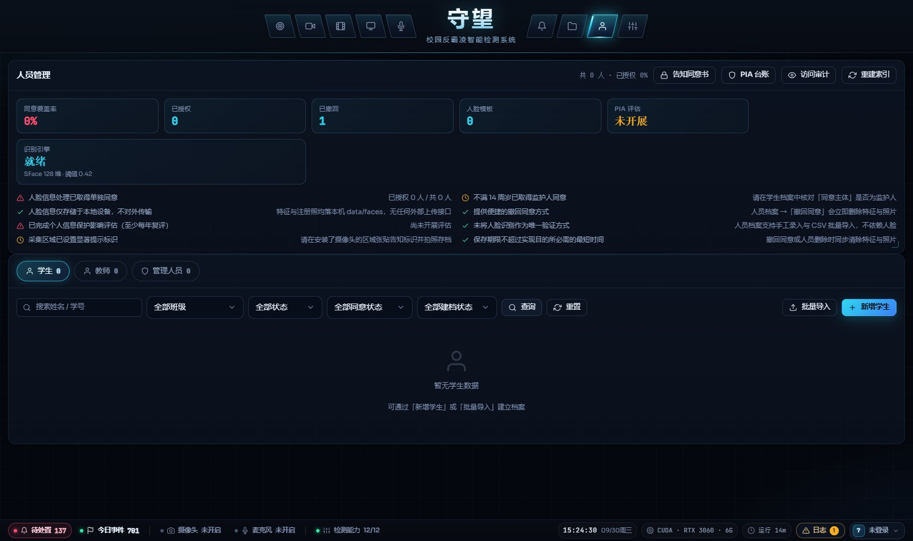<br/><div align="center"><b>人员管理</b> · 学生 / 教师 / 管理人员花名册，一张照片完成人脸建档与授权登记</div></td>
</tr>
<tr>
<td width="50%">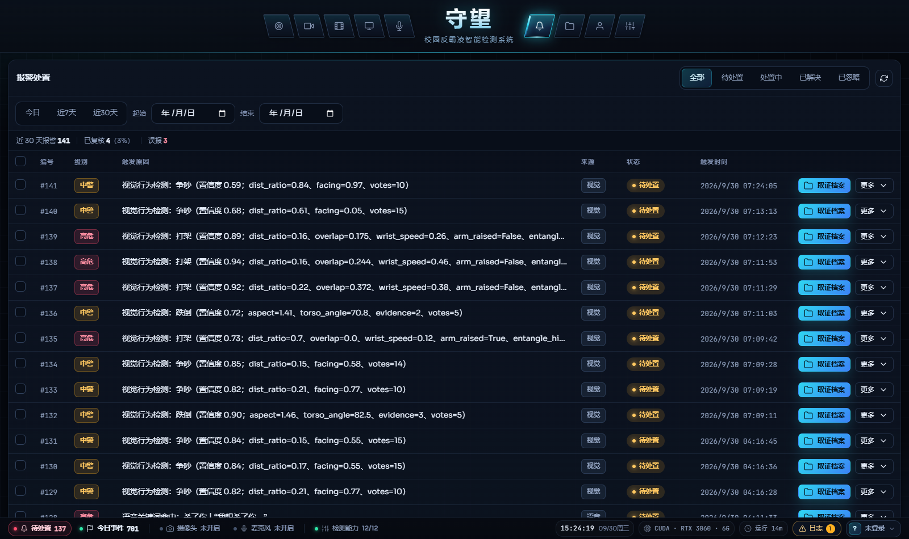<br/><div align="center"><b>报警处置</b> · 筛选、批量处置、关联取证与误报反馈</div></td>
<td width="50%">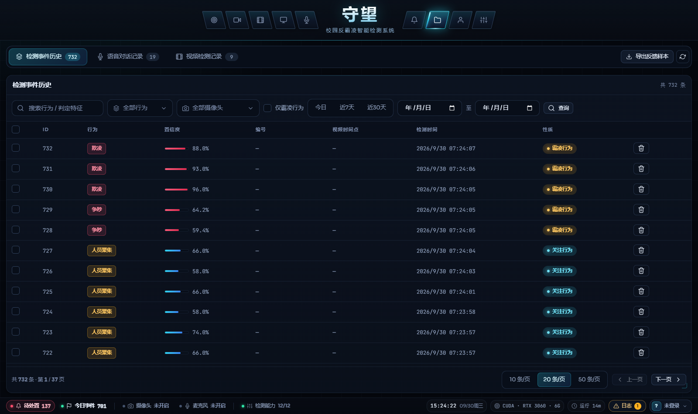<br/><div align="center"><b>历史取证</b> · 检测事件 / 语音对话 / 视频检测 三栏检索与导出</div></td>
</tr>
<tr>
<td width="50%">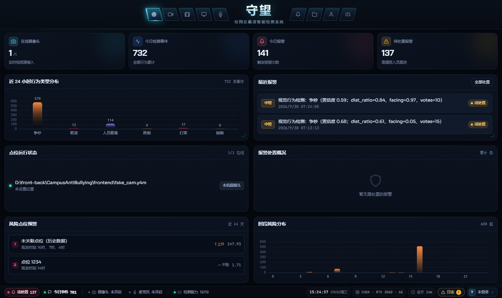<br/><div align="center"><b>用户与权限</b> · 系统账号可写，学生 / 教师 / 管理人员花名册只读可查</div></td>
<td width="50%">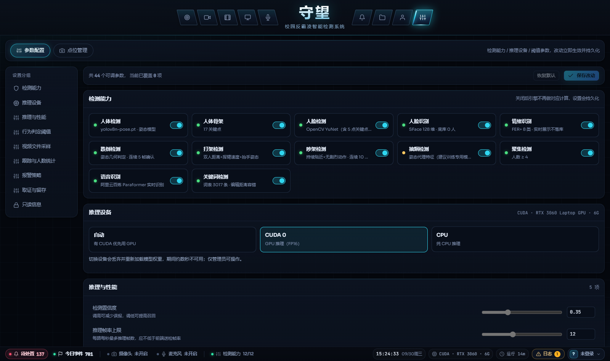<br/><div align="center"><b>系统设置</b> · 检测能力开关、推理设备、44 项可调参数（改完立即生效）与点位管理</div></td>
</tr>
<tr>
<td width="50%">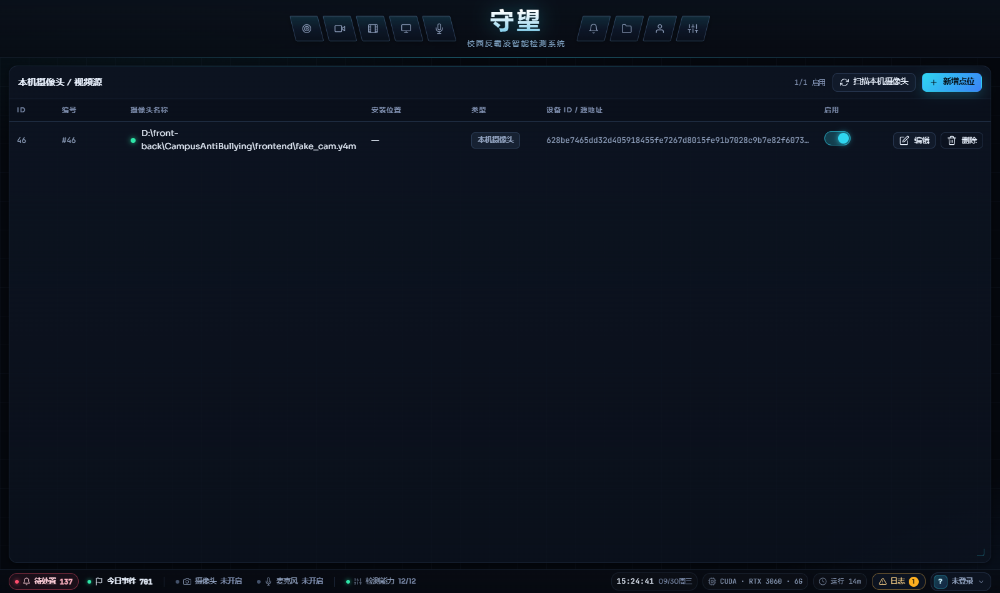<br/><div align="center"><b>点位管理</b> · 摄像头增删改查、区域与隐私遮蔽设置</div></td>
<td width="50%">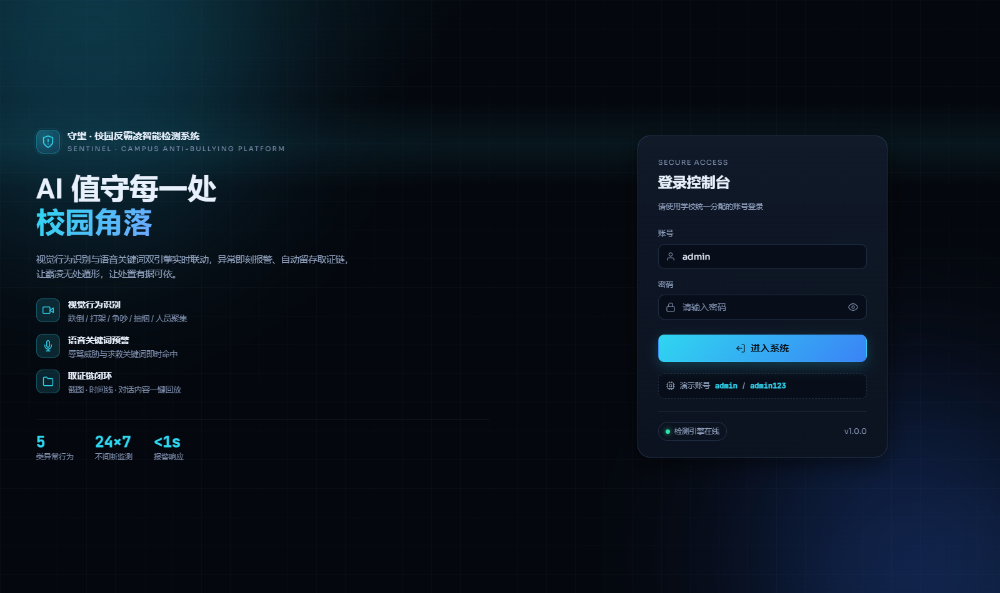<br/><div align="center"><b>登录页</b> · 中英双语标题与能力概览，带登录失败锁定</div></td>
</tr>
<tr>
<td colspan="2">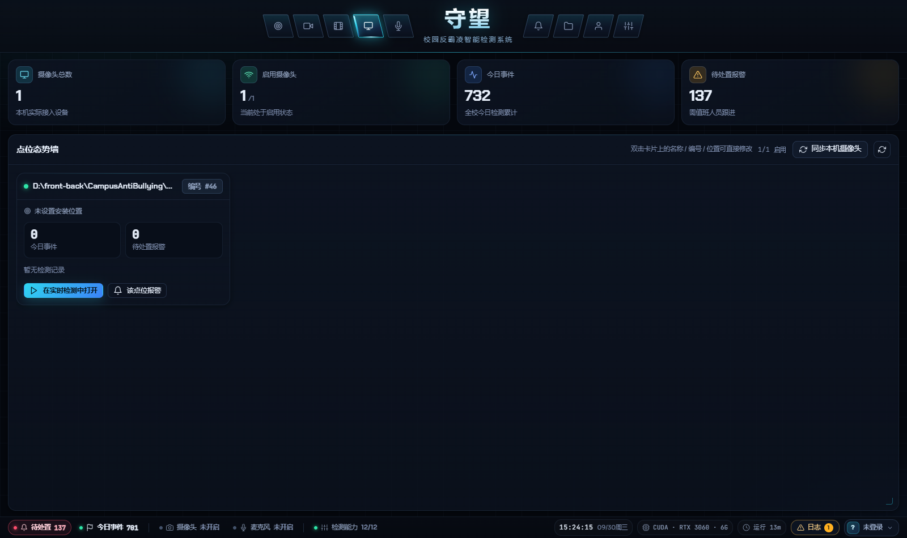<br/><div align="center"><b>点位态势墙</b> · 按点位汇总今日事件、待处置报警与在线状态（大屏视图，故整行展示）</div></td>
</tr>
</table>

> 截图由 `frontend/scripts/screenshot.mjs` 自动生成（固定 1600×950 视口，含内容自检），
> UI 改版后执行 `npm run shot` 即可整体刷新，避免文档里混着新旧两套界面。

## 核心能力

| 能力 | 说明 |
|---|---|
| 人体检测 | YOLOv8 人员检测，支持 GPU(FP16) / CPU 热切换 |
| 人体骨架 | YOLOv8-Pose 单次前向同时输出人体框与 COCO-17 关键点 |
| 人脸检测 | OpenCV YuNet（含 5 点关键点），完全离线 |
| 人脸识别 | SFace 128 维特征，1:N 检索用「阈值 + top1/top2 间隔」双重裁决；**仅对已授权人员建档** |
| 情绪识别 | FER+ 八类表情，EMA + 多数投票平滑；**实时展示、不落库、不进档案** |
| 跌倒检测 | 外接框宽高比 + 躯干与竖直方向夹角 + 头部塌陷程度联合判定 |
| 打架检测 | 双人距离比 + 框交叠 + 手腕速度 + 抬手姿态，多帧投票去抖 |
| **群体欺凌** | 以「跨帧打斗关系图」识别多对一：攻击者各自连向受害者、彼此不相连即星型图 |
| 欺凌判别 | 互动对称性分析（运动不对称 / 退缩不对称 / 追逃模式 / 压制姿态）区分单向欺凌与对等冲突，并识别课间嬉闹 |
| 吵架检测 | 持续贴近 + 身体直立 + 无剧烈挥臂（与打架互斥） |
| 抽烟检测 | 手腕—鼻尖接近度 + 肘部高于胯部的持续姿态 |
| 聚集检测 | 同帧人员数量与密度阈值 |
| 人数统计 | 已确认活跃轨迹数 + 时间窗中位数 + 不对称迟滞（+1 需 3 帧、−1 需 8 帧），遮挡不跳变 |
| 多目标跟踪 | 自研 8 维匀速卡尔曼滤波 + 两阶段关联（高分宽门限 / 低分严门限）+ 轨迹确认门控 + 时间化 TTL |
| 语音识别 | ASR Provider 可插拔：阿里云百炼 Paraformer / 阿里云 NLS / 本地 Vosk |
| 关键词检测 | Aho-Corasick 自动机（3000+ 条词库，匹配耗时与词表规模无关）+ 首字锚定的编辑距离容错 |
| 三档响应 | `alarm` 触发报警 / `warn` 仅提示 / `highlight` 仅高亮 —— 词表上千条后，控误报比提召回更重要 |
| 视频文件检测 | 上传成片离线分析，采样按画面运动自适应（静止稀疏、动作密集），输出标注视频与事件时间轴 |
| 人员档案 | 学生 / 教师 / 管理人员三张花名册 + 班级 + 人脸授权登记与撤回留痕 |
| 生物特征合规 | 未授权不建档、可撤回、操作留痕、PIA 记录与同意书模板，对照《人脸识别技术应用安全管理办法》 |
| 报警编排 | 置信度阈值 → 事件去重 → 冷却窗口 → 取证固化 → Webhook 外呼 |
| 多模态融合 | 视觉与语音在时间窗内互证，置信度上浮、级别只升不降 |
| 隐私遮蔽 | 目标框中心落在遮蔽区则不产生事件、不落取证（数据最小化） |
| 取证留存 | 截图 + 事发前后视频片段 + 转写文本，按留存天数自动清理 |
| 运行时参数 | 44 项可调参数（阈值 / 推理 / 报警 / 取证 / 视频采样 / 跟踪），页面上改完立即生效，落库持久化且可一键回到 `.env` 基线 |

## 系统架构

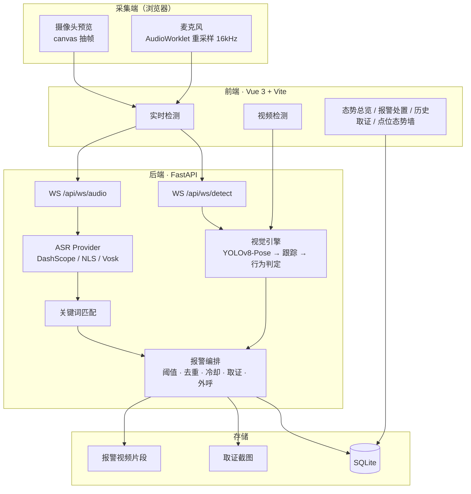

## 一次检测的完整链路

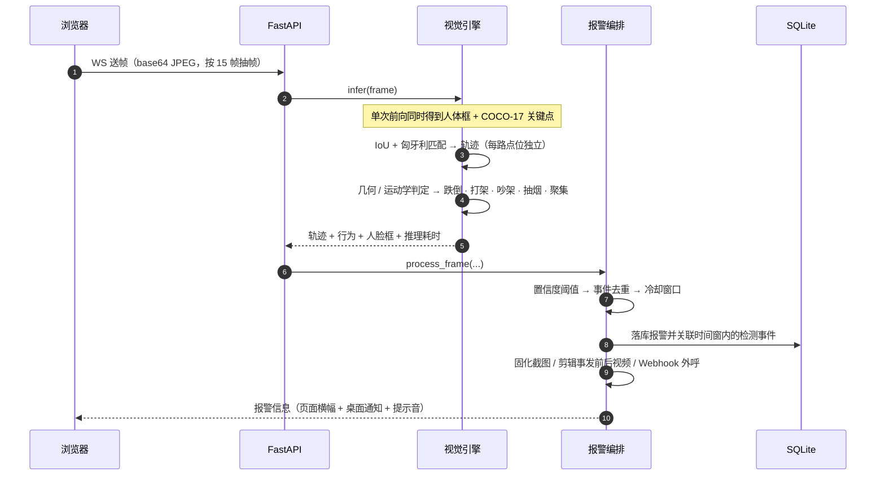

## 技术栈

| 层 | 选型 |
|---|---|
| 前端 | Vue 3 + Vite + Pinia + Vue Router；纯自研 CSS 组件层（无第三方 UI 框架），深色安防指挥中心风格 |
| 图表 | ECharts（态势总览） |
| 后端 | FastAPI + SQLAlchemy 2.0（async）+ aiosqlite + Pydantic v2 |
| 视觉 | Ultralytics YOLOv8（检测 / 姿态）、OpenCV、NumPy、SciPy（匈牙利匹配） |
| 语音 | 阿里云百炼 Paraformer 实时识别 / 阿里云智能语音交互 NLS / Vosk 本地离线 |
| 鉴权 | JWT（业务令牌与取证媒体令牌分离，媒体令牌带 scope 限制）+ HttpOnly Cookie |
| 存储 | SQLite（事件 / 报警 / 转写 / 运行时状态）+ 本地文件（截图与视频片段） |

## 目录结构

```
CampusAntiBullying/
├── backend/
│   ├── app/
│   │   ├── audio/            # ASR Provider（dashscope / aliyun / vosk）、AC 关键词引擎与 3000 条词库
│   │   ├── core/             # 配置、数据库、鉴权依赖、安全、时间工具、运行时参数覆盖层
│   │   ├── models/           # ORM 模型（含人员档案、人脸授权、关键词与审计）
│   │   ├── routers/          # 接口：鉴权 / 点位 / 检测 / 视频 / 报警 / 历史 / 系统 / 媒体
│   │   │                     #      + 人员与班级 / 人脸建档识别 / 关键词 / 系统设置 / 合规自检
│   │   ├── schemas/          # 请求与响应模型
│   │   ├── services/         # 报警编排、剪辑、取证、外呼、留存、人员档案、人脸索引、视频流水线
│   │   ├── vision/           # 推理引擎、跟踪（KF）、行为判定、人脸检测/识别、情绪、隐私遮蔽
│   │   └── main.py           # 应用入口与生命周期
│   ├── datasets/             # 行为模型训练数据配置
│   ├── scripts/              # 训练 / 评估 / 自检 / 真实素材评测脚本
│   ├── models/               # YOLO 与人脸/情绪权重（缺失时自动下载）
│   ├── data/                 # SQLite 库、上传、取证、视频片段
│   ├── requirements.txt
│   └── .env.example
├── frontend/
│   ├── scripts/
│   │   └── screenshot.mjs    # README 界面截图自动生成（固定视口 + 内容自检）
│   ├── src/
│   │   ├── components/       # 应用外壳、状态栏、日志面板、人员卡片
│   │   ├── ui/               # 自研基础组件（Modal / Drawer / Toast / 图标 …）
│   │   ├── views/            # 十一个业务页面
│   │   ├── stores/           # Pinia：鉴权与本地设备状态
│   │   ├── audio/            # PCM 重采样 AudioWorklet
│   │   ├── api/              # 请求封装与 WebSocket 地址
│   │   └── style.css         # 设计令牌与全局组件样式
│   └── vite.config.js
├── docs/
│   ├── images/               # 界面截图（README 使用）
│   ├── 校园反霸凌智能检测系统-技术设计方案.md
│   └── 运行与联调指南.md
└── README.md
```

## 快速开始

### 1. 后端

```powershell
cd backend

# 创建虚拟环境
python -m venv .venv
.venv\Scripts\python -m pip install -U pip wheel

# PyTorch 需从官方 CUDA 源安装（CPU 机器把 cu121 换成 cpu）
.venv\Scripts\python -m pip install torch==2.4.1 torchvision==0.19.1 --index-url https://download.pytorch.org/whl/cu121

# 其余依赖
.venv\Scripts\python -m pip install -r requirements.txt

# ultralytics 会连带装 GUI 版 opencv，服务器无显示环境需换回 headless
.venv\Scripts\python -m pip uninstall -y opencv-python
.venv\Scripts\python -m pip install opencv-python-headless==4.10.0.84

# 配置环境变量
Copy-Item .env.example .env      # 按需填写，重点是 CAB_DASHSCOPE_API_KEY

# 启动
.venv\Scripts\python -m uvicorn app.main:app --host 0.0.0.0 --port 8000 --reload
```

首次启动会自动下载 `yolov8n.pt` 与 `yolov8n-pose.pt` 到 `backend/models/`，并预热推理引擎。

### 2. 前端

```powershell
cd frontend
npm install
npm run dev          # http://127.0.0.1:5173
```

> **请用 `127.0.0.1` 而不是 `localhost` 访问。** 开发服务器绑定的是 IPv4，
> 而 Windows 上 `localhost` 会优先解析到 IPv6 的 `::1`。若本机 5173 端口上
> 还跑着别的项目，浏览器会连到那个项目上去，表现为"打开的是另一个系统"，
> 很容易被误判成服务没起来。

### 3. 登录

默认管理员 `admin / admin123`（**仅开发环境**，生产启动时会强制要求替换）。

### 4. 一键脚本（Windows，可跳过上面的手工步骤）

仓库根目录提供两个批处理脚本，**双击即可运行**：

| 脚本 | 用途 | 执行内容 |
|---|---|---|
| `一键启动.bat` | 开发 / 联调 | 环境自检 → 缺 `.env` 时自动从样例生成 → 拉起后端 (8000) 与前端 (5173) → 打开浏览器 |
| `一键部署.bat` | 单机生产部署 | 生产配置预检 → 构建前端静态资源 → 拉起后端 (8000) 与前端 (4173) |

两个脚本都会先做环境自检（缺 `.venv` 或 `node_modules` 时给出明确的安装指引），并在端口被占用时提前告警；两个服务分别运行在独立窗口中，**关闭窗口即停止对应服务**，主窗口会等待回车后退出，不会一闪而过。

> 脚本以 **GBK 编码**保存。这是必要而非疏漏：中文 Windows 控制台默认代码页为 936，
> 若改用 UTF-8 保存，`cmd` 在解析时会出现行偏移错乱（表现为执行到中途报出莫名其妙的
> `'xx' 不是内部或外部命令`）。用编辑器打开若显示乱码，请把编码手动切为 GBK/ANSI。

正式对外发布时，建议改用 Nginx 托管 `frontend/dist`，并把 `/api` 反向代理到
`http://127.0.0.1:8000`；WebSocket 路径 `/api/ws/` 需转发 `Upgrade` 与 `Connection` 头，
否则实时检测与语音通道建立不起来。

## 配置要点

完整变量见 [`backend/.env.example`](backend/.env.example)，以下几点最常调整：

| 变量 | 作用 | 建议 |
|---|---|---|
| `CAB_DEVICE` | 推理设备 `auto` / `cuda:0` / `cpu` | 有独显填 `auto`；页面上也可热切换 |
| `CAB_INFER_FPS_LIMIT` | 每路每秒最多推理帧数 | 默认 12，多路并发可下调 |
| `CAB_MOTION_GATE_ENABLED` | 画面静止时跳过推理 | 无人时段可大幅省算力，建议保持开启 |
| `CAB_ASR_PROVIDER` | 语音识别通道 | `dashscope`（推荐，只需 API Key）/ `aliyun` / `vosk` |
| `CAB_ALARM_MIN_CONFIDENCE` | 报警置信度阈值 | 现场误报多则上调 |
| `CAB_ALARM_COOLDOWN_SEC` | 同点位报警冷却 | 默认 8 秒，防刷屏 |
| `CAB_EVIDENCE_KEEP_DAYS` | 取证留存天数 | 按学校合规要求设置 |

## 生产部署

启动前请依次确认（`CAB_ENV=production` 时这些不满足会**直接拒绝启动**）：

- `CAB_SECRET_KEY` 替换为 32 位以上随机串
- `CAB_INITIAL_ADMIN_PASSWORD` 替换默认弱口令
- `CAB_CORS_ORIGINS` 显式列出来源域名，**不可**使用 `*`
- HTTPS 部署下 `CAB_MEDIA_COOKIE_SECURE=true`
- 位于反向代理之后时，才把 `CAB_TRUST_PROXY_HEADERS=true`（否则客户端可伪造 `X-Forwarded-For` 绕过登录失败锁定）

生产环境会自动关闭 `/docs`、`/redoc`、`/openapi.json`，避免接口与数据模型暴露给匿名访问者。

## 已知限制

- 行为判定基于**几何与运动学规则**而非端到端行为模型，光照剧烈变化、严重遮挡、极端视角下准确率会下降；已提供 `scripts/train_behavior.py` 用于训练自定义行为权重（配置 `CAB_YOLO_BEHAVIOR_WEIGHTS` 即可启用）。
- 语音链路依赖外部服务或本地模型：云端需要有效 API Key，Vosk 首次使用需下载约 42MB 中文模型。
- 登录失败限流目前为**进程内实现**，多实例部署需替换为 Redis 等共享存储。
- 单机 SQLite，适合单校部署；跨校区大规模并发建议迁移到 PostgreSQL。

## 许可

MIT License。用于校园安全防护场景，请遵循当地关于视频监控与个人信息保护的法律法规，并在部署前取得必要的告知与授权。

---

<div align="center">
<sub>守望 · Sentinel — 让每一次求助都被看见</sub>
</div>
