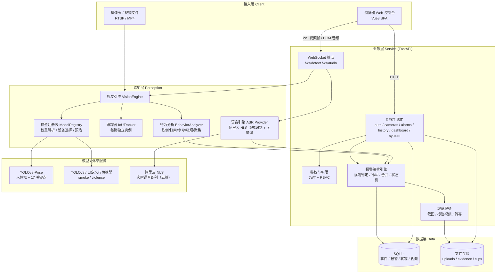
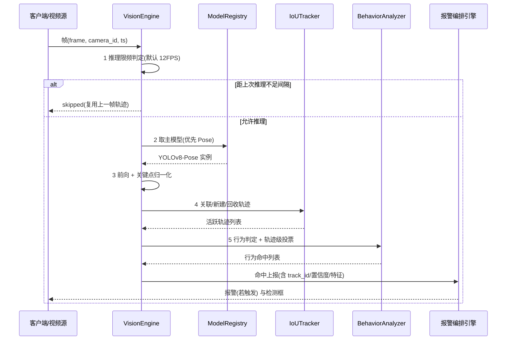
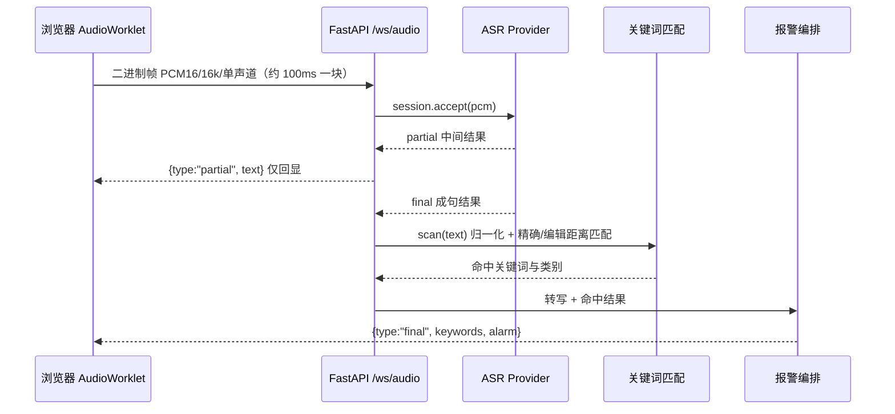
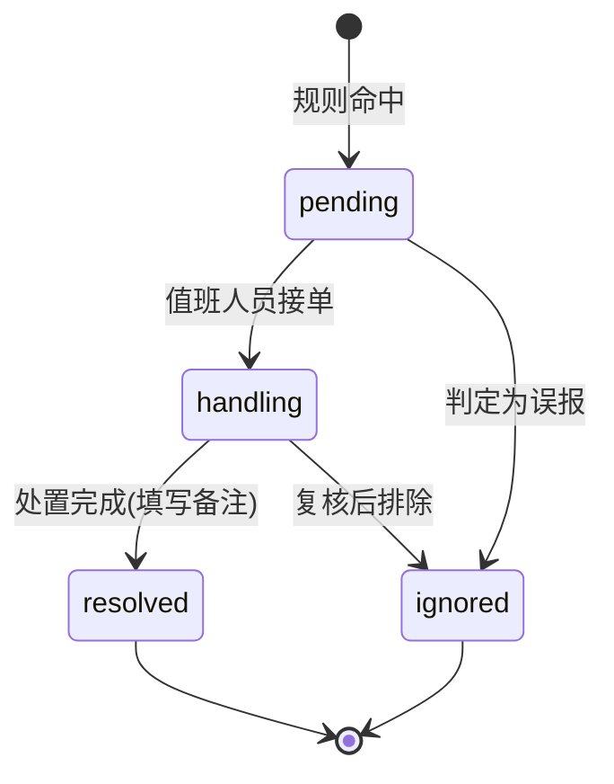
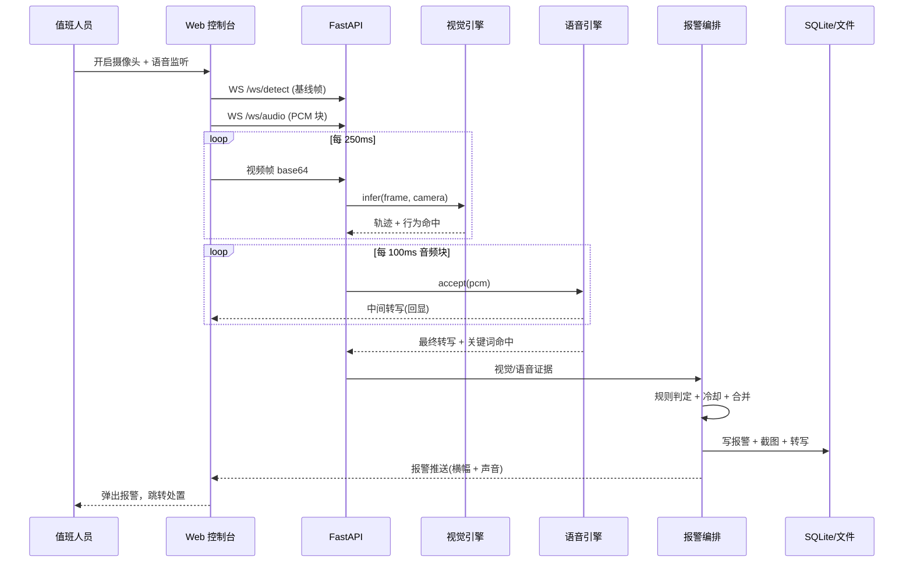
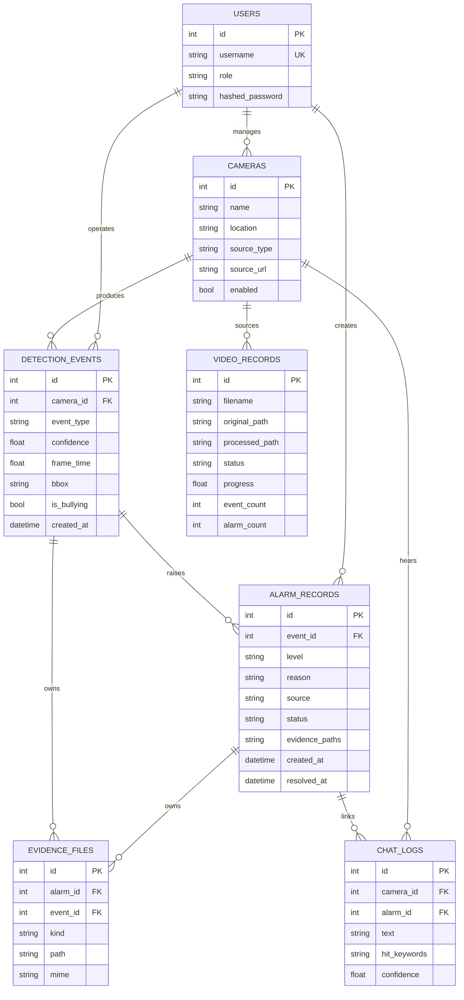
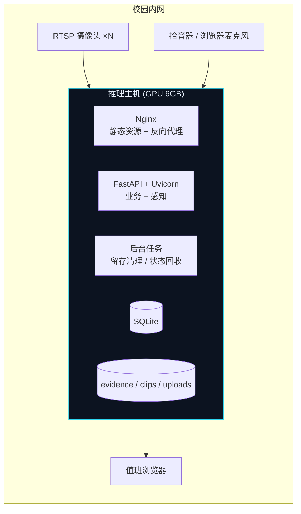

# 守望 Sentinel · 校园反霸凌智能检测系统 · 技术设计方案

> 文档类型：概要设计（HLD）+ 关键技术设计 + 接口与数据设计　|　版本：v2.0　|　适用读者：架构评审、后端/前端工程师、算法工程师、安全合规

## 1 设计概述

### 1.1 目标与范围

系统面向中小学与寄宿制学校的公共区域（走廊、操场、食堂、连廊、宿舍公共区），把"人工盯屏"变成"机器值守 + 人工处置"：摄像头画面与麦克风音频经本地 AI 推理后，自动识别异常行为与敏感语音，触发分级报警并固化取证材料，供值班人员第一时间处置、事后追溯。

设计覆盖：实时视频行为检测、视频文件离线检测、实时语音识别与关键词命中、分级报警与推送、取证与历史回溯、登录鉴权与角色权限。

明确不在本期范围：人脸识别与身份绑定（涉及未成年人生物特征，另行评估合规）、跨校区多租户与计费、移动端 App、模型自动再训练的完整 MLOps 平台（仅提供训练脚本与反馈数据落库）。

### 1.2 需求追溯

需求来自任务书，编号 R1–R6。每条需求对应的设计落点如下，后续模块与接口均可回溯至此表。

| 编号 | 需求 | 设计落点 |
|---|---|---|
| R1 | 实时视频流检测跌倒、吵架、打架、抽烟 | §4.1 视觉链路、§4.2 行为判定、§5 视觉感知模块 |
| R2 | 上传/接入视频文件做同样检测 | §5 视频流水线模块、`POST /api/video/upload` |
| R3 | 实时语音检测敏感词与触发关键词 | §4.3 语音链路、`WS /api/ws/audio` |
| R4 | 命中关键词或异常行为自动报警并推送 | §6 报警规则与状态机、`AlarmRecord` |
| R5 | 历史记录：时间戳、回放、聊天内容取证 | §8 数据设计、`/api/history/*` |
| R6 | 登录鉴权与权限管理界面 | §7.3 鉴权与权限矩阵、`/api/auth/*` |

### 1.3 设计约束与假设

约束：**视频推理必须本地部署**，画面不出厂区 `[Data-backed]`；**语音识别走云端**（阿里云智能语音交互 NLS），音频会离开厂区，需完成校内数据合规审批并落实 §9.2 的最小化与不留存措施 `[Data-backed]`；推理节点为单机 GPU（NVIDIA RTX 3060 Laptop 6GB）`[Data-backed]`；数据层限定 SQLite，不引入独立数据库服务。

假设（未经上游确认，落地前需复核）：单校区摄像头规模 8–16 路，其中同时开启实时 AI 分析的并发路数 ≤ 4；单路摄像头 1080p/25fps；值班室并发在线用户 ≤ 10 `[Hypothesis]`。

### 1.4 术语

| 术语 | 含义 |
|---|---|
| 轨迹（Track） | 同一人在连续帧中的稳定 ID 及其历史序列，行为判定均基于轨迹而非单帧 |
| 行为命中（Behavior Hit） | 单帧算法判定出的候选行为，尚未去抖 |
| 事件（Event） | 经过多帧投票确认、写入 `detection_events` 的行为记录 |
| 报警（Alarm） | 由事件或语音关键词升级而来、需要人工处置的记录 |
| 取证材料 | 报警时刻的截图、标注视频、音频转写文本 |
| 冷却窗口 | 同一来源在时间窗内不重复报警的抑制机制 |

## 2 开源选型与理由

### 2.1 选型结论

| 能力 | 选型 | 备选 | 决策 |
|---|---|---|---|
| 目标检测基座 | Ultralytics YOLOv8 | YOLOv11、RT-DETR、PP-YOLOE | 采用，但标注许可风险 |
| 人体姿态 | YOLOv8-Pose（COCO-17） | MediaPipe Pose、RTMPose | 采用 |
| 多目标跟踪 | 自研 IoU + 匈牙利匹配 | ultralytics ByteTrack、OC-SORT | 自研（多路状态隔离） |
| 暴力识别精判 | 预留 TSN/ST-GCN 接口 | 纯骨架规则 | 骨架规则为主，精判为可选 |
| 语音识别 | 阿里云智能语音交互（NLS 实时识别） | Vosk 本地、Whisper、讯飞、腾讯云 | 云端为主，Vosk 作离线兜底 |
| 关键词匹配 | 归一化 + 模糊匹配 | 纯正则 | 采用模糊匹配 |
| 硬件加速 | CUDA（本机）/ 可插拔 ONNX-TensorRT | Coral EdgeTPU、OpenVINO | 设备抽象层 |

### 2.2 逐项理由

**检测基座选 YOLOv8。** 校园场景的核心需求是"多人、小目标、实时"，YOLOv8 的解耦检测头与 Anchor-Free 设计在保持实时性的同时对小目标更友好，且在公开工程实践中已被大量安防类项目验证 `[Research-backed]`。选 `n` 规模（约 6MB 权重）而非 `m/l`：现场以半身到全身的人体框为主，不需要细粒度类别，优先保证多路并发时的帧率。

**姿态选 YOLOv8-Pose。** 一次推理同时输出人体框与 17 个关键点，框与关键点天然对齐，省掉"检测 + 单独姿态模型"的两次前向与框匹配，这对 4 路并发是直接的算力节省。COCO-17 的肩/肘/腕/胯/膝/踝足以支撑跌倒、挥臂、手-口鼻接近度三类判定。开源跌倒检测项目也普遍采用这一组合——例如 `Real-Time-Person-Elderly-Fall-Detection-System` 就按 `detector / tracker / kinematics / state_machine` 分层组织 `[Research-backed]`。

**跟踪自研而非直接用 ByteTrack。** ultralytics 的 `model.track(persist=True)` 把跟踪器状态挂在模型实例上，多路摄像头交替送帧会互相污染轨迹 ID。本设计为每路摄像头维护独立跟踪器实例，关联代价在 IoU 上叠加中心距惩罚，并用指数滑动平均估计速度做一步预测，改善快速移动人员的关联稳定性。社区实现也有同样结论：多路场景必须做跟踪状态隔离 `[Expert judgment]`。

**暴力识别以骨架运动学为主、时序网络为可选精判。** Vi-SAFE 用"YOLOv8 提取人体区域 + TSN 做时序二分类"在 RWF-2000 上取得 0.88 准确率，但该方案需要独立的时序网络与更长的时间窗，实时性与显存开销都不适合在 6GB 显卡上跑多路 `[Research-backed]`。因此本设计把暴力拆成两层：**实时层**用骨架运动学（手腕归一化速度、肢体纠缠度、手臂伸展度、双人中心距）做低延迟判定；**精判层**预留统一的动作分类接口，接入 TSN/ST-GCN 时可无缝替换，而不改动上游链路。

**语音识别选阿里云 NLS 实时识别。** 语音链路的硬要求是"边说边出词"（流式）与"中文可用"，同时系统部署在校园边缘节点、要求尽量少的模型运维。阿里云 NLS 实时识别原生提供 WebSocket 流式接口，云端自带端点检测（VAD）判定成句，因此服务端不需要再实现一套静音切分逻辑，延迟与准确率都优于本地小模型 `[Research-backed]`。相较同类方案：腾讯云、讯飞能力相当，选择阿里云是因为其 Token 鉴权可以完全用标准库（HMAC-SHA1 的 RPC 签名）实现，不引入厂商 SDK 依赖，便于容器化与依赖收敛 `[Expert judgment]`。

代价是音频离开厂区。对此的措施是：只在检测到有效语音活动时上传、不在服务端留存原始音频（仅落转写文本）、凭据以 AccessKey 托底并支持外置 Token 服务（§9.2）。

**保留 Vosk 作为离线兜底而非主链路。** Vosk 能把音频留在本地，但中文小模型（约 50MB）的准确率明显低于云端，且模型文件需要随部署包分发。因此把它降级为"无外网或未配置云端凭据"时的降级方案，通过 `CAB_ASR_PROVIDER=vosk` 一键切换。这样既保证生产链路质量，又保证现场断网时系统不会完全失去语音能力 `[Expert judgment]`。

**关键词匹配用归一化 + 编辑距离模糊匹配。** ASR 对同音字经常出错（"打死你" → "打士你"），纯子串匹配会漏报。设计在归一化（全角转半角、去标点空白、英文小写）之后，对长度 ≥3 的关键词按长度容忍错字数（3 字容 1 字、6 字容 2 字）做编辑距离比对，并对插入/删除各扩一个字符的窗口。这里刻意不用相似度比率：3 字词错 1 字时序列相似度只有 0.67，会把真实命中判丢 `[Expert judgment]`。

**推理门控借鉴 Frigate 的流水线。** Frigate 的工业级做法是：解码 → 降采样到低分辨率子码流 → 运动检测（低成本）→ **仅对运动区域**跑目标检测 → 事件/录像按留存策略落盘 `[Research-backed]`。本设计在同一思路上实现推理限频（默认 12 FPS 上限）与轨迹 TTL 回收，避免对静止画面做无效前向。

### 2.3 许可与合规风险

Ultralytics YOLO 全系（含自训练模型）默认采用 **AGPL-3.0**；官方明确：用于商业产品、闭源软件、SaaS 平台、硬件/边缘设备嵌入，或使用其训练流程产出的模型，都必须**要么整体开源，要么购买企业授权** `[Research-backed]`。本项目若以闭源商业方式交付给学校或集成商，存在明确合规风险。

处置方案（三选一，需业务决策）：① 采购 Ultralytics 企业授权；② 整体按 AGPL-3.0 开源；③ 更换为宽松许可的推理栈（如自训练后导出 ONNX，用 ONNX Runtime / TensorRT 推理，不依赖 ultralytics 运行时）。本设计的 `ModelRegistry` 已把权重加载与推理调用做了薄封装，切换路径③只需替换该层 `[Expert judgment]`。

### 2.4 未采用方案

| 方案 | 未采用原因 |
|---|---|
| MediaPipe Pose | 无法与 YOLO 检测共用一次前向；多目标支持弱于 YOLOv8-Pose |
| 纯 3D CNN / 视频分类模型直出暴力 | 显存与延迟不满足 4 路并发实时；且缺乏可解释的中间证据 |
| 云端视频分析 | 校园画面不得出厂区，与本地化约束直接冲突（语音与视频的合规边界不同，故分开决策） |
| 本地 ASR 作为主链路 | 中文小模型准确率不达生产要求，模型文件还须随包分发；降为离线兜底 |
| 端到端大模型视频理解 | 单机 6GB 显存无法承载，且无法给出帧级取证证据 |

## 3 系统架构

### 3.1 架构风格与驱动因素

采用**分层单体 + 独立感知线程池**。选择单体而非微服务，驱动因素是部署环境：校园侧通常只有一台推理主机，微服务带来的服务发现、跨进程序列化、运维复杂度与其收益不成正比；而感知层（GPU 推理）与业务层（鉴权、报警、取证）的负载特征差异极大，因此用**进程内分层 + 独立线程池隔离**来替代物理拆分——推理阻塞不会拖垮 API 响应。

四层职责：接入层（浏览器、摄像头、视频文件）、业务层（FastAPI 路由与鉴权）、感知层（视觉引擎、语音引擎）、数据层（SQLite + 文件存储）。

### 3.2 总体架构图

图中接入层分两条独立通道：浏览器既走 HTTP 走业务接口，也走 WebSocket 推视频帧与音频块；摄像头/视频文件则直接在服务端被感知层消费，不经浏览器中转。感知层内部严格单向依赖——视觉引擎依赖模型注册表与跟踪器、行为分析器，绝不被它们反向依赖；报警编排引擎是感知层与数据层之间唯一的写入口，保证"报警产生"这件事只有一处逻辑。

### 3.3 组件职责与边界

| 组件 | 拥有 | 不拥有 | 依赖 |
|---|---|---|---|
| 模型注册表 `ModelRegistry` | 权重路径解析、设备选择、模型加载缓存、预热、状态上报 | 推理语义、业务事件 | ultralytics、torch |
| 跟踪器 `IoUTracker` | 单路轨迹生命周期、ID 分配、速度估计 | 行为语义 | numpy、scipy |
| 行为分析器 `BehaviorAnalyzer` | 单路行为判定与轨迹级投票 | 落库、报警等级、取证 | 跟踪轨迹、关键点 |
| 视觉引擎 `VisionEngine` | 组装推理链路、每路管线隔离、推理限频 | 报警决策 | 上述三者 |
| 语音引擎 `ASRFacade` + `ASRProvider` | 流式识别会话、厂商切换、鉴权与就绪状态 | 关键词判定、报警决策 | 阿里云 NLS（云端）/ Vosk（本地兜底） |
| 报警编排引擎 | 规则判定、冷却、事件合并、状态机、取证触发 | 单帧算法细节 | 感知层输出 |
| 取证服务 | 截图/标注视频/转写文件落盘与登记 | 报警状态 | OpenCV、Pillow |

### 3.4 主要数据流

实时视频链路：浏览器摄像头 → 每 15 帧抽 1 帧 → canvas 压至 640 宽 JPEG → base64 → `WS /api/ws/detect` → 视觉引擎限频判定 → 命中则跟踪 → 行为分析 → 报警编排 → 触发则落库 + 存证 → 回传检测框与报警 JSON。

实时语音链路：浏览器麦克风 → AudioWorklet 采 PCM16/单声道 → 重采样 16kHz → 二进制块 → `WS /api/ws/audio` → ASR Provider 流式识别（阿里云 NLS；中间结果实时回显，成句结果才参与报警）→ 关键词扫描 → 命中则报警编排 → 转写入库。

视频文件链路：上传落盘 → 后台任务逐帧解码 → 强制推理（不限频）→ 行为分析 → 事件与报警落库 → 输出标注视频 → 进度回写。

## 4 感知与识别设计

### 4.1 视觉链路

单帧处理分为五步，其中第 3 步是控制成本的关键。

第 1 步限频是显存与帧率的平衡点：25fps 的源每秒只送 12 帧进模型，人眼看到的画面仍是原帧率，检测框复用上一帧结果，视觉上无感但算力减半。第 3 步把所有坐标统一归一化到 0–1，使下游所有阈值与画面分辨率解耦，换摄像头无需重新标定阈值。

### 4.2 行为判定算法

所有判定基于真实几何与运动学量，阈值集中在 `core/config.py`，可按现场视角标定。

**跌倒。** 三个独立证据加权：① 外接框宽高比 ≥ 1.05（横向躺倒）；② 躯干向量（肩中点→胯中点）与竖直方向夹角 ≥ 52°；③ 鼻尖相对胯中点的高度差小于 0.55 倍肩宽（头部塌陷）。三证全中置信度 0.90，两证 0.72，单证 0.45 且不触发。必须有 ≥2 个证据同时成立，且连续命中 ≥5 帧才升级为事件——这一"多证据 + 持续帧"的组合正是抑制"坐下、系鞋带、捡东西"误报的关键，与公开跌倒检测项目的楼层/姿态/持续判定思路一致 `[Research-backed]`。

**打架。** 成对判定。前置条件是双人中心距 / 平均身高 ≤ 1.75；在此之上满足任一动作证据：肢体外接框交叠比 ≥ 0.06、手腕归一化速度 ≥ 0.62/秒、或手腕抬升至肩线以上（出拳/推搡姿态）。连续命中 ≥4 帧升级。置信度由速度、交叠度与距离共同加权。速度由轨迹历史回溯 4 帧计算——EMA 平滑后的速度够用但响应更快，故此处用原始回溯。

需要说明的是，"手腕抬升"这一判别量是替代早期设计的"腕-肩距离 / 肩宽 ≥ 2.1"的：后者在手臂自然下垂时该比值约为 2.2–2.6，会把正常站立的学生判成打架，属于设计缺陷，已在实现中废弃。

**争吵。** 同样是成对判定，条件与打架互斥：中心距 / 平均身高 ≤ 2.2、双方均直立（躯干夹角 ≤ 52°）、且手腕速度低于打架阈值。连续命中 ≥10 帧升级——争吵是持续性行为，需要的确认窗口比打架长。语音侧的辱骂/威胁关键词命中会与视觉争吵在报警编排层融合，形成同一报警。

**疑似吸烟。** 手腕到鼻尖的归一化距离 / 肩宽 ≤ 0.62，且同侧肘部高度低于胯部（手臂抬起），连续命中 ≥8 帧。因 COCO 无 cigarette 类别，此处以姿态接近度作为代理特征，标签如实标注为"疑似"；若配置了自定义行为权重（`YOLO_BEHAVIOR_WEIGHTS`），模型输出的 cigarette/smoke 类别将以更高优先级直接命中，姿态规则退为兜底。

**人员聚集。** 同帧活跃轨迹数 ≥ 4，置信度随人数增长封顶 0.95。仅记事件、不强制报警。

### 4.3 语音链路

浏览器侧用 AudioWorklet 采集原始 PCM（而非浏览器自带的 SpeechRecognition），理由是：自带识别把音频上送厂商云端且链路不可控，拿不到词级置信度，也无法统一在服务端做关键词策略与取证落库。

服务端把音频转发给 ASR Provider 的流式会话。上层只依赖 `ASRProvider` / `ASRSession` 两个接口，因此更换厂商不需要改动报警编排：

阿里云实现下，`accept()` 把 PCM 推给 NLS 网关的 WebSocket，云端回传 `TranscriptionResultChanged`（中间）与 `SentenceEnd`（成句）；鉴权用 AccessKey 调 `CreateToken` 动态签发并按过期时间缓存，也支持由外部令牌服务直接提供 Token 以免在应用内放置长期凭据。

**中间结果不参与报警**是这一层的关键约束：`partial=True` 的段只用于前端实时回显，只有成句的终稿才送入关键词与报警，从根本上消除"同一句话反复报警"。容忍误字的编辑距离匹配已在验证中确认：`打士你` 能正确命中 `打死你`（编辑距离 1），而 `今天天气不错我们去操场吧` 不产生任何命中。

## 5 模块设计

| 模块 | 职责（单一） | 输入 | 输出 | 依赖 |
|---|---|---|---|---|
| `core/config` | 集中配置与阈值 | 环境变量 | Settings 单例 | pydantic-settings |
| `core/db` | 引擎与会话生命周期 | — | AsyncSession | SQLAlchemy、aiosqlite |
| `core/security` | 密码哈希与 JWT 签发校验 | 明文/JWT | 哈希/用户 ID | passlib、jose |
| `vision/registry` | 权重解析、设备选择、模型加载与预热 | 权重名 | 模型实例、状态 | ultralytics、torch |
| `vision/engine` | 单路管线组装、推理限频 | 帧 | 轨迹 + 行为命中 | registry/tracker/behaviors |
| `vision/tracker` | 单路轨迹关联与生命周期 | 检测框 | 稳定轨迹 | numpy、scipy |
| `vision/behaviors` | 行为判定与投票 | 轨迹 | 行为命中 | 关键点几何 |
| `vision/draw` | 结果可视化与标注 | 帧 + 轨迹 | 标注帧 | OpenCV |
| `audio/asr` | 识别门面：就绪状态与厂商切换 | 配置 | 识别会话 | `audio/providers` |
| `audio/providers/base` | Provider / Session 抽象契约 | — | 接口定义 | — |
| `audio/providers/aliyun` | 阿里云 NLS 鉴权与实时识别 | PCM 块 | 转写段 | websockets |
| `audio/providers/vosk_local` | 本地离线识别兜底 | PCM 块 | 转写段 | vosk（可选） |
| `audio/keywords` | 关键词归一化与匹配 | 文本 | 命中列表 | 编辑距离 |
| `services/alarm` | 报警规则、冷却、合并、取证触发 | 感知结果 | 报警记录 | 全感知层 |
| `services/video_pipeline` | 视频逐帧推理与标注输出 | 视频文件 | 事件/报警/标注视频 | engine、alarm |
| `routers/*` | HTTP/WS 契约与鉴权 | 请求 | 响应 | core、services |

模块边界遵循单向依赖：`routers → services → vision|audio → core`，无反向依赖，无环。

## 6 报警规则与实时处理流程

### 6.1 规则矩阵

| 触发源 | 条件 | 级别 | 冷却 | 取证材料 |
|---|---|---|---|---|
| 视觉·打架 | 行为命中且置信度 ≥ 0.55 | 高危 | 同点位 8s | 截图 + 报警片段（前 3s 预录 + 后 5s 延录） |
| 视觉·争吵 | 同上 | 中警 | 同点位 8s | 截图 + 报警片段 |
| 视觉·跌倒 | 同上 | 中警 | 同点位 8s | 截图 + 报警片段 |
| 视觉·疑似吸烟 | 同上 | 提示 | 同点位 8s | 截图 |
| 语音·威胁辱骂 | 关键词命中（成句结果） | 高危 | 同点位 8s | 转写文本 + 命中词 |
| 语音·求救 | 关键词命中（成句结果） | 中警 | 同点位 8s | 转写文本 + 命中词 |
| 视觉·聚集 | 人数 ≥ 4 | — | — | 仅记事件 |

视频文件分析的取证方式不同：源视频本身有时间轴，报警时直接按时间点裁剪前后片段，比实时链路的环形缓冲更精确、开销也更低。

冷却键为**「点位 + 来源」**而非仅点位：视觉报警不应压制同一路音频报警，否则"先打架、后呼救"这类连续事件会丢失第二条证据。同类事件在 5s 合并窗口内合并为同一报警，避免报警风暴；冷却与去重状态存放在带 TTL 的 `runtime_state` 表中，多 worker 与重启后行为一致。

### 6.2 报警状态机

状态迁移只允许图中路径，`resolved` 与 `ignored` 均写入 `resolved_at` 时间戳，形成完整处置链。误报数据同时落库，作为模型迭代的反馈样本来源。

### 6.3 端到端实时流程

## 7 接口设计

### 7.1 接口清单

| ID | 方法与路径 | 用途 | 鉴权 |
|---|---|---|---|
| I1 | `POST /api/auth/login` | 登录换取 JWT，并下发媒体 Cookie | 公开（有限流） |
| I2 | `POST /api/auth/logout` | 注销并清除媒体 Cookie | 公开 |
| I3 | `GET /api/auth/me` | 当前用户 | 登录 |
| I4 | `POST /api/auth/password` | 自助改密（校验原密码） | 登录 |
| I5 | `GET/POST /api/auth/users`、`PATCH /api/auth/users/{id}`、`POST /api/auth/users/{id}/password` | 用户与权限管理 | admin |
| I6 | `GET /api/cameras` `POST /api/cameras` `PATCH/DELETE /api/cameras/{id}` | 点位管理 | 登录 |
| I7 | `POST /api/detect/frame` | 单帧检测（HTTP 兜底） | 登录 |
| I8 | `WS /api/ws/detect` | 实时视频帧检测流 | 子协议令牌 |
| I9 | `WS /api/ws/audio` | 实时音频识别流（二进制 PCM） | 子协议令牌 |
| I10 | `POST /api/video/upload` | 上传视频并触发离线检测 | 登录 |
| I11 | `GET /api/video` `GET /api/video/{id}` | 视频检测记录与进度 | 登录 |
| I12 | `GET /api/alarms` `GET /api/alarms/{id}` `PATCH /api/alarms/{id}` | 报警查询与处置（含误报反馈） | 登录 |
| I13 | `GET /api/alarms/summary`、`POST /api/alarms/bulk/status` | 报警聚合与批量处置 | 登录 |
| I14 | `GET /api/history/events` `/chatlogs` `/videos` `/case/{alarm_id}` | 历史与取证档案 | 登录 |
| I15 | `GET /api/history/export/alarm/{id}` `/export/feedback` | 证据包 zip 与反馈样本导出 | 登录 |
| I16 | `GET /api/media/{相对路径}` | 取证媒体读取（截图/片段/转写） | 媒体 Cookie 或 Bearer |
| I17 | `GET /api/dashboard/stats` | 态势统计 | 登录 |
| I18 | `GET /api/system/models` `/config` | 推理引擎与运行参数状态 | 登录 |
| I19 | `POST /api/system/retention/run` | 手动触发留存清理 | admin |
| I20 | `GET /api/health` | 健康检查 | 公开 |

### 7.2 关键接口契约

**I9 `WS /api/ws/audio`**

| 字段 | 值 |
|---|---|
| 连接 | `wss://host/api/ws/audio`，令牌通过**子协议**传递：`new WebSocket(url, ['cab.v1', token])` |
| 客户端上行 | 二进制帧，PCM 16-bit 小端、单声道、16000Hz；文本帧为控制指令（`{"camera_id": n}` / `{"flush": true}`） |
| 服务端下行 | JSON 文本帧：`{ "type": "partial" \| "final", "text": string, "confidence": number, "start": number, "end": number, "keywords": string[], "alarm": object \| null }` |
| 错误下行 | `{ "type": "error", "error": "speech_disabled" \| "asr_unavailable" \| "asr_runtime", "detail": string }` 随后服务端关闭连接 |
| 识别引擎 | 由 `CAB_ASR_PROVIDER` 决定（`aliyun` 云端 / `vosk` 本地兜底），下行结构不体现厂商差异，前端无需感知 |
| 关闭码 | `4401` 令牌无效或缺失；`1011` 引擎不可用 |
| 约束 | 建议块大小 40ms（1280 字节）；非 16k 单声道音频须在客户端重采样 |

令牌为什么不放在查询参数：WebSocket 握手无法携带自定义请求头，而把 JWT 放进 URL 会被 Nginx/uvicorn 的访问日志与浏览器历史完整记录，等效于长期凭据泄露。改用 `Sec-WebSocket-Protocol` 字段后，令牌只存在于握手头中，与请求头同等安全等级。

**I16 `GET /api/media/{相对路径}`**

| 字段 | 值 |
|---|---|
| 用途 | 读取取证截图、报警片段、标注视频、转写文本 |
| 鉴权 | 登录时下发的 HttpOnly Cookie `cab_media`（`scope=media`，`path=/api/media`），也支持 `Authorization: Bearer` 供脚本调用 |
| 路径约束 | 仅允许 `evidence/`、`clips/`、`uploads/` 三个子目录；解析后校验必须落在数据根目录内 |
| 错误码 | `400` 非法路径 / 目录穿越；`401` 未登录或凭证失效；`403` 目录不在白名单；`404` 文件不存在 |
| 缓存 | `private, max-age=300`，避免留存清理后仍被长期缓存 |

**I12 `GET /api/alarms`**（分页结构）

| 字段 | 值 |
|---|---|
| 查询参数 | `status`、`level`、`source`、`camera_id`、`date_from`、`date_to`、`offset`、`limit`(≤500) |
| 响应 | `{ items: AlarmOut[], total: int, offset: int, limit: int }` |
| 时间参数 | 接受 ISO 字符串或 `YYYY-MM-DD`；纯日期按当日 00:00 解释，前端需自行补 `T23:59:59` 以保证区间闭包 |

**I18 `GET /api/system/models`**

| 字段 | 值 |
|---|---|
| 响应 | `{ device, half, imgsz, device_info: { torch, cuda_available, gpu, gpu_memory_gb }, models: { detect\\|pose\\|behavior: { weights, path, loaded, error } }, speech: { engine, ready, model, sample_rate, error } }` |
| 用途 | 控制台展示"引擎已就绪/降级"状态；运维排查权重缺失 |

**I12 `PATCH /api/alarms/{id}`**

| 字段 | 值 |
|---|---|
| 请求体 | `status`（枚举 pending/handling/resolved/ignored，可选）、`note`（可选）、`feedback_label`（false_positive/not_bullying/confirmed/other，可选）、`ignored_reason`（可选） |
| 副作用 | 变更 `status` 时记录 `handler_id`（实际处置人）；`resolved`/`ignored` 时写入 `resolved_at` |
| 反馈用途 | `feedback_label` + `ignored_reason` 构成误报样本，经 `GET /api/history/export/feedback` 导出用于再训练 |
| 错误码 | `404 ALARM_NOT_FOUND`；`400` 状态或标签不合法 |

### 7.3 鉴权与权限矩阵

采用 JWT（HS256，有效期 12 小时），载荷含 `sub`（用户 ID）与 `role`。WebSocket 因无法携带自定义请求头，改用查询参数传 token 并在握手阶段校验，失败即以 `4401` 关闭。

| 角色 | 实时/视频检测 | 报警处置 | 点位配置 | 用户管理 |
|---|---|---|---|---|
| admin 管理员 | ✓ | ✓ | ✓ | ✓ |
| operator 值班员 | ✓ | ✓ | ✗ | ✗ |
| viewer 观察员 | 只读 | 只读 | ✗ | ✗ |

### 7.4 错误码

| 码 | 含义 | 处理 |
|---|---|---|
| 400 | 图像解码失败 / 视频格式不支持 | 前端提示重选文件 |
| 401 | 令牌缺失、无效或过期 | 清除本地令牌并跳登录 |
| 403 | 角色权限不足 / 账号禁用 | 提示权限不足 |
| 404 | 报警、摄像头、视频记录不存在 | 提示记录已失效并刷新 |
| 409 | 用户名已存在 | 表单级提示 |
| 503 | 视觉模型未就绪 / 语音引擎不可用 | 提示"引擎加载中或不可用"，前端禁用对应检测入口 |

## 8 数据设计

### 8.1 实体关系

### 8.2 表结构与设计要点

| 表 | 关键字段 | 设计要点 |
|---|---|---|
| `users` | `username` 唯一索引、`role`、`disabled` | 角色用字符串枚举而非外键表，避免为三种固定角色引入连接开销 |
| `cameras` | `source_type`、`source_url`、`enabled` | `source_type` 区分 webcam/rtsp/file，为后续接入真实 RTSP 留出入口 |
| `detection_events` | `event_type`、`confidence`、`frame_time`、`is_bullying` | `frame_time` 区分来源：>0 为视频文件检测（可定位回放时间点），=0 为实时检测 |
| `alarm_records` | `level`、`source`、`status`、`camera_id`、`handler_id`、`feedback_label`、`ignored_reason`、`evidence_paths` | `camera_id` 使取证档案可按点位+时间窗聚合；`handler_id` 记录实际处置人（区别于 `creator_id` 的创建人）；`feedback_label` + `ignored_reason` 构成误报样本，支撑再训练闭环 |
| `chat_logs` | `text`、`hit_keywords`、`alarm_id`、`is_final` | **所有**成句转写都落库（含未命中项），只有命中项关联 `alarm_id`——这样"对话上下文"可完整还原，而不只剩报警那几句；`is_final` 区分流式中间结果 |
| `video_records` | `status`、`progress`、`event_count`、`processed_path` | 进度落库而非内存，进程重启后仍可展示；`processed_path` 指向标注视频 |
| `evidence_files` | `kind`、`path`、`mime` | `kind` 枚举 frame/clip/audio/transcript，前端按类型渲染 |
| `runtime_state` | `key`（主键）、`value`、`expires_at`（索引） | 承载报警冷却与事件去重状态，带 TTL 并周期回收。放在库里而非进程内字典，是为了多 worker / 多实例部署下行为一致、重启不丢状态 |

### 8.3 索引与留存

对高频查询路径建索引：`detection_events.camera_id`、`detection_events.event_type`、`detection_events.created_at`、`alarm_records.status`、`alarm_records.camera_id`、`runtime_state.expires_at`、`users.username` 唯一索引。

留存策略由后台任务执行（`RETENTION_ENABLED`，默认每 6 小时一次）：先按 `created_at` 删除过期数据库行（EvidenceFile → AlarmRecord/DetectionEvent/ChatLog/VideoRecord，子表优先），再按文件修改时间清理 `evidence/`、`clips/`、`uploads/` 下的过期文件与孤儿文件，避免出现"记录已删但文件仍在"或反之的悬空状态。SQLite 开启 WAL 模式以允许"写入报警"与"读取统计"并发。

## 9 非功能设计

### 9.1 性能

| 目标 | 设计策略 |
|---|---|
| 单路端到端延迟 ≤ 1.5s（视觉） | 推理限频 12FPS + 抽帧 640 宽 + GPU FP16 |
| 单路端到端延迟 ≤ 1s（语音） | 云端流式识别，成句即回传，不等整段音频结束 |
| 空场景算力占用接近零 | 运动门控：相邻帧灰度差低于阈值时跳过推理 |
| 多观看者不重复耗算力 | 同一路共享限频窗口与推理结果，N 个页面只推理一次 |
| 4 路并发 | 每路独立跟踪器/分析器，模型与显存共享（单例注册表），轨迹 TTL 回收释放内存 |
| API 响应 ≤ 200ms | 推理在独立调用路径，不占用 API 事件循环；SQLite WAL 支持读写并发 |

实测数据（RTX 3060 Laptop 6GB，YOLOv8n-Pose，单帧单人～多人画面，12 次取中位数）：`imgsz=640` 单帧 28ms（约 35 FPS），`imgsz=480` 26ms。首次推理 3.2s 为 CUDA 上下文初始化与 kernel 编译，必须在服务启动时预热掉，不能计入运行时指标 `[Data-backed]`。按 12 FPS 限频计算，单路仅占用约 1/3 的 GPU 时间，4 路并发的算力预算是可行的。

两处成本优化值得单独说明。**运动门控**借鉴 Frigate 的流水线思路，把"是否有活动"这个廉价判断放在模型之前：夜间走廊、无人教室这类画面几乎不变的场景不再持续跑推理；同时设了强制间隔（默认 2s），保证即使长期静止也会周期性复核一次，不会因为门控而永久错过缓慢变化的异常。**同点位结果共享**解决的是另一种浪费：同一路摄像头若被多个值班页面同时观看，按朴素实现会各自触发一次推理，开三个页面就是三倍算力；由于管线本身按点位隔离、限频窗口天然共享，再让跳过帧复用上一次的行为结果即可——前端不会看到行为框闪烁，算力也不随观看人数增长。

算力不足时的降级顺序：关闭姿态（`ENABLE_POSE=false`，仅保留人员/聚集）→ 下调推理帧率上限 → 下调输入尺寸至 480。该顺序保证"先牺牲精度、后牺牲实时性"，因为漏报的代价高于画质。

### 9.2 安全与隐私

视频与语音采取不同的合规边界，这是本项目一个需要明示的取舍。**视频画面严格本地处理**，不出厂区；**语音识别走云端**（阿里云 NLS），音频会离开厂区。后者需要完成校内数据合规审批，并落实以下措施：

- **最小化上传**：只在检测到有效语音活动（云端 VAD 判定）时才产生识别请求，静音时段不推流；不采集视频中无关人员的持续音频。
- **不留存原始音频**：服务端只把成句文本落库用于取证，收到后即转发、不落盘音频文件；`data/evidence/` 下只存在截图与转写文本。
- **凭据最小暴露**：优先由外部令牌服务签发短期 Token 注入 `CAB_ALIYUN_NLS_TOKEN`，应用内不放置长期 AccessKey；若必须使用 AccessKey，则只读权限、按环境隔离、通过环境变量注入而非写入代码或镜像。
- **厂商侧约束**：与厂商签署数据处理协议，明确不得用于模型训练与二次留存。
- **可一键降级**：`CAB_ASR_PROVIDER=vosk` 即可切到本地识别，用于合规审批未通过或需完全离线的场景。

传输层生产环境必须启用 HTTPS/WSS，避免视频帧与 PCM 在局域网明文传输。鉴权采用 JWT + RBAC 双要素：身份（你是谁）与角色（能做什么）分离，用户管理接口仅管理员可达。

**取证媒体不匿名暴露。** 取证截图是未成年人画面，是整套系统里最敏感的数据。因此不采用"把目录挂成静态资源"的做法，而是统一经 `/api/media/{路径}` 鉴权后返回：路径解析后必须落在数据根目录内（阻断 `../` 穿越），且只允许 `evidence`、`clips`、`uploads` 三个子目录。为了让 `` / `<video>` 这类无法自定义请求头的标签也能加载，登录时额外下发一个 HttpOnly、`scope=media` 的 Cookie——它只能读媒体、不能调用业务接口，即使泄露也无法越权；脚本与第三方集成则可用 `Authorization: Bearer`。

**凭据不再出现在 URL 里。** WebSocket 握手带不了自定义请求头，常见做法是把令牌塞进查询参数，但这会让 JWT 完整落入访问日志与浏览器历史。本设计改为通过 `Sec-WebSocket-Protocol` 子协议字段传递，令牌与请求头同级。

**登录防撞库。** 按「用户名 + 客户端 IP」统计失败次数，窗口内超过阈值即锁定一段时间并返回 `429`。该状态当前在进程内维护，多实例部署需换 Redis——这一限制已在此显式记录，避免上线后被误认为全局生效 `[Hypothesis]`。

**生产配置强制校验。** 以 `CAB_ENV=production` 启动时，若 `SECRET_KEY` 仍为默认值、`CORS_ORIGINS` 含通配符、或媒体 Cookie 未开启 `Secure`，服务直接拒绝启动。开发环境只打印告警，不阻塞本地调试。CORS 采用显式来源白名单，因为 `allow_origins=["*"]` 与 `allow_credentials=True` 在浏览器规范下本就互斥，且会让任意站点携带用户凭据发起跨站请求。

其余隐私边界：本期不做人脸识别与身份绑定，避免采集未成年人生物特征；证据文件按 90 天留存并到期清理；全部证据访问均带鉴权，静态文件目录不对外匿名开放。密码使用 bcrypt 加盐哈希，不存明文，自助改密需校验原密码，管理员重置密码与新增用户均强制 8 位以上。密钥通过环境变量注入，默认值仅供开发。

### 9.3 可用性

模型加载失败时系统不整体崩溃：注册表记录失败原因并暴露到 `GET /api/system/models`，前端据此显示"引擎未就绪"并禁用检测入口，鉴权、历史、报警处置等不依赖推理的功能仍可用——这保证了局部故障不扩大为全站不可用。

### 9.4 可观测性

当前提供健康检查（`/api/health`）、引擎与模型状态（`/api/system/models`）、单帧推理耗时（`FrameResult.infer_ms`，EMA 平滑）、视频检测进度（`video_records.progress`）。生产环境应补充：推理帧率与队列深度的时序指标、报警触发/误报比例、模型加载与失败事件的结构化日志。

### 9.5 模型迭代闭环

误报样本通过"忽略"动作落库（`alarm_records.status='ignored'` + `note`），配合 `detection_events` 中的轨迹特征，形成再训练数据来源。自定义行为模型（抽烟、暴力）通过 `scripts/train_behavior.py` 在标注数据集上微调，产出权重放入 `backend/models/` 并在配置中指定 `YOLO_BEHAVIOR_WEIGHTS` 即生效，无需改动推理代码。这一"反馈 → 重训 → 热替换"的闭环是误报率随时间下降的机制保证。

## 10 错误处理与部署

### 10.1 错误分类与策略

| 类别 | 典型场景 | 策略 |
|---|---|---|
| 输入错误 | 图像解码失败、视频格式不支持、文件超限 | 立即返回 4xx 并提示，不重试；上传按 1MB 分块落盘并累计校验体积，避免一次性读入内存 |
| 模型错误 | 权重缺失、显存不足 | 记录失败原因并暴露状态，禁用检测入口，业务功能降级可用 |
| 依赖错误 | 云端 ASR 鉴权失败或连接中断 | 语音链路标记不可用并明确提示；视觉链路不受影响 |
| 外部通知失败 | Webhook 不可达 | 报警先落库、通知异步外发，失败只记日志——**绝不能因为通知失败而丢失报警** |
| 资源错误 | 推理超时、视频任务过多 | 实时链路跳帧（复用上一帧轨迹）而非排队；视频分析用信号量串行，避免多任务抢显存 OOM |
| 数据错误 | 报警被并发处置、状态非法迁移 | 状态机限定合法迁移路径，非法状态返回 400 |

优雅降级原则：感知层任一路径失败，只影响该路径对应的能力，鉴权、历史查询、报警处置、取证浏览始终可用。

### 10.2 部署拓扑与后台任务

单机部署：Nginx 承载前端静态资源并反代 `/api`、`/ws`；FastAPI 单进程多线程（感知调用走线程池）；SQLite 与文件存储同机。进程内另有两个后台任务随应用生命周期启停：留存清理按 `RETENTION_INTERVAL_SEC` 周期执行（启动后延迟 60s 首跑，避开模型预热的 IO 争抢），运行时状态回收每 10 分钟清理过期键。两者均可通过配置关闭，也可由管理员用 `POST /api/system/retention/run` 手动触发。

横向扩展到多校区时，把感知层拆为独立推理服务、SQLite 换 PostgreSQL、冷却状态与登录限流换 Redis、报警编排引入消息队列解耦，即可复用现有模块边界——这些改造点都收敛在少数几个模块内，不需要重写业务逻辑。
